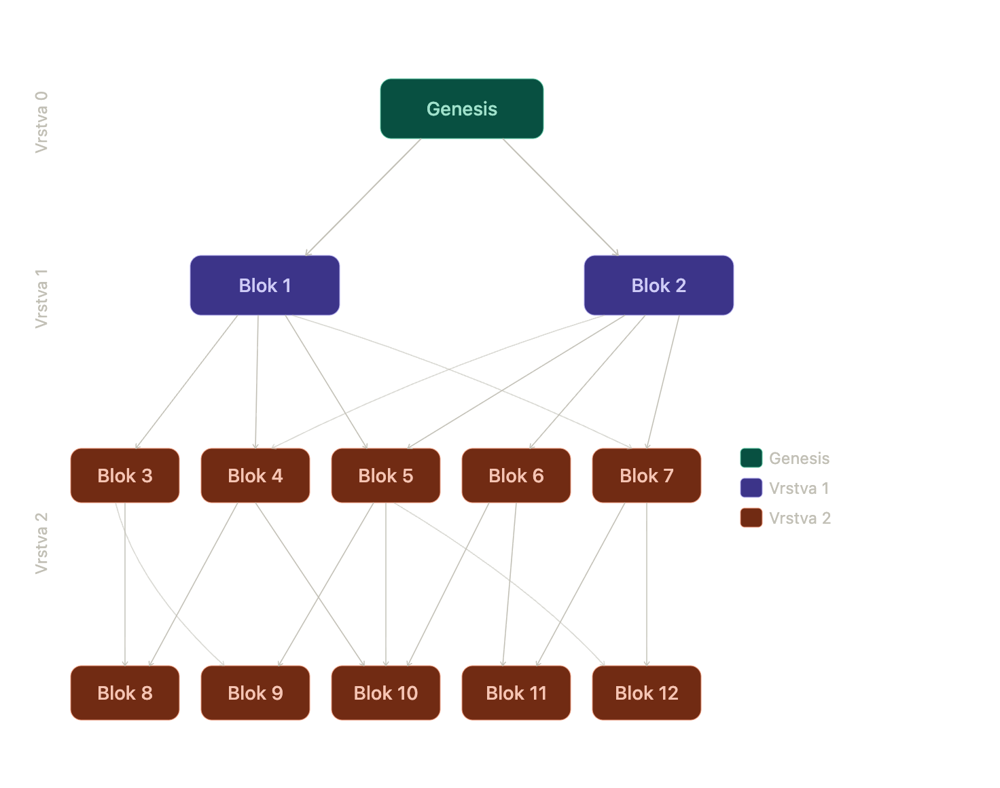
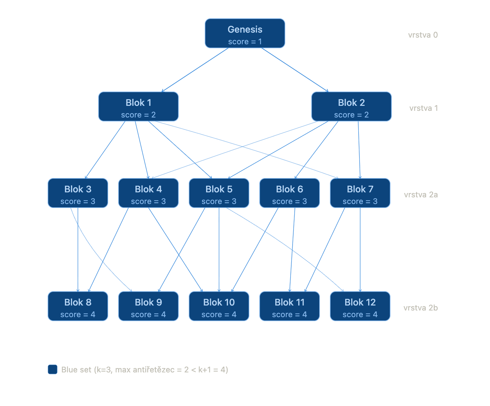

# Kaspa algoritmus řazení paralelních bloků

**Definice grafu (hrany — každý blok referencuje své rodiče):**

- B1 → Genesis, B2 → Genesis
- B3 → B1, B4 → B1, B2; B5 → B1, B2; B6 → B2; B7 → B1, B2
- B8 → B3, B4; B9 → B3, B5; B10 → B4, B5, B6; B11 → B6, B7; B12 → B5, B7

---

## Vyhodnocení pořadí I.

Shrnutí výsledku GHOSTDAG s k=3 (Topologické pořadí blue-setu (dle GHOSTDAG, hloubka + hash))

**Výsledek:** Blue = {G, B1, B2, B3, B4, B5, B6, B8, B9, B10} | Red = {B7, B11, B12}
**Blue-set (10 bloků):** Genesis, B1, B2, B3, B4, B5, B6, B8, B9, B10
**Red (3 bloky):** B7, B11, B12 (vyřazeny z pořadí, ale existují v DAGu): B7, B11, B12

Topologické pořadí blue-setu (dle GHOSTDAG, hloubka + hash):

**G → B1 → B2 → B3 → B4 → B5 → B6 → B8 → B9 → B10**

Red bloky (vyřazeny z pořadí, ale existují v DAGu): B7, B11, B12

### Podrobný postup

**Krok 1 — Genesis**

Genesis nemá žádné předchůdce. Anticone(Genesis) = ∅. Genesis → **BLUE** ✓

Blue-set: {G}

---

**Krok 2 — Vrstva 1: B1 a B2**

B1 a B2 jsou paralelní — navzájem jsou v anticone (žádný není předchůdcem toho druhého).

- B1: past(B1) = {G}. Anticone B1 vůči blue-setu = {B2}. |anticone| = 1 ≤ k=3 → **BLUE** ✓
- B2: past(B2) = {G}. Anticone B2 vůči blue-setu = {} (B1 je už blue, ale B2 je potomek G, ne B1). Anticone(B2) ∩ blue = {B1}. |anticone| = 1 ≤ 3 → **BLUE** ✓

Blue-set: {G, B1, B2}

---

**Krok 3 — Vrstva 2 (B3–B12): výběr blue parenta a přidávání**

Každý blok v této vrstvě má jako rodiče bloky z vrstvy 1. Projdeme je v topologickém pořadí. Blue parent = rodič s největším blue-set v minulosti.

Pro každý blok Bx spočítám jeho anticone vůči dosavadnímu blue-setu: to jsou bloky ve stejné vrstvě, které nejsou v past(Bx) ani Bx není v jejich past.

**B3** (rodiče: B1): anticone(B3) ∩ blue = {B2, B4,B5,B6,B7,B8...B12} — ale zatím z vrstvy 2 není nic blue. Anticone ve vrstvě 1 = {B2}. |anticone| = 1 ≤ 3 → **BLUE** ✓

**B4** (rodiče: B1, B2): anticone = bloky sourozenci, které nejsou předci ani potomci. Ve vrstvě 2 zatím blue = {B3}. B3 a B4 mají společného rodiče ale nejsou propojeni → anticone. |anticone ∩ blue| = 1 ≤ 3 → **BLUE** ✓

**B5** (rodiče: B1, B2): anticone ∩ blue = {B3, B4}. |anticone| = 2 ≤ 3 → **BLUE** ✓

**B6** (rodiče: B2): anticone ∩ blue = {B3, B4, B5} (všechny jsou blue a žádný není v past B6 ani B6 v jejich past). |anticone| = 3 ≤ 3 → **BLUE** ✓

**B7** (rodiče: B1, B2): anticone ∩ blue = {B3, B4, B5, B6}. |anticone| = 4 > k=3 → **RED** ✗

**B8** (rodiče: B3, B4): anticone ∩ blue = {B5, B6} (B3,B4 jsou v past B8, B7 je red). |anticone| = 2 ≤ 3 → **BLUE** ✓

**B9** (rodiče: B3, B5): anticone ∩ blue = {B4, B6, B8}. |anticone| = 3 ≤ 3 → **BLUE** ✓

**B10** (rodiče: B4, B5, B6): anticone ∩ blue = {B3, B8, B9}. |anticone| = 3 ≤ 3 → **BLUE** ✓

**B11** (rodiče: B6, B7): anticone ∩ blue = {B3, B4, B5, B8, B9, B10}. |anticone| = 6 > 3 → **RED** ✗

**B12** (rodiče: B5, B7): anticone ∩ blue = {B3, B4, B6, B8, B9, B10}. |anticone| = 6 > 3 → **RED** ✗

---

# Vytěžím 2 další bloky 

- **Blok X** — rodiče: B1, B2 (stejná vrstva jako B3–B7, ale s malým hashem → zpracován jako první ve vrstvě)
- **Blok Y** — rodiče: B3, B4, B5, B6, B7, X (agreguje celou předchozí vrstvu + X)

**útok paralelními bloky** — útočník se snaží pomocí X "obsadit místo" v blue-setu a vytlačit poctivé bloky, pak Y vše zakryje velkým anticone.

---

## Scénář B — výpočet s X a Y

Nyní přidám X a Y a přepočítám celý blue-set.

**X** má rodiče B1, B2 a **lexikograficky nejmenší hash ve vrstvě** → zpracován jako úplně první mezi B3–B7 a X.

Topologické pořadí zpracování vrstvy 2 (řada 1): **X, B3, B4, B5, B6, B7**

- **X**: anticone ∩ blue = {} (ještě nikdo jiný ze sourozenců není blue) → **BLUE** ✓
- **B3**: anticone ∩ blue = {X} → 1 ≤ 3 → **BLUE** ✓
- **B4**: anticone ∩ blue = {X, B3} → 2 ≤ 3 → **BLUE** ✓
- **B5**: anticone ∩ blue = {X, B3, B4} → 3 ≤ 3 → **BLUE** ✓
- **B6**: anticone ∩ blue = {X, B3, B4, B5} → **4 > 3 → RED** ✗
- **B7**: anticone ∩ blue = {X, B3, B4, B5} → **4 > 3 → RED** ✗

X tedy svou přítomností vytlačil B6 (a B7 zůstal red stejně jako dříve). Blue v této vrstvě: {X, B3, B4, B5}.

**Y** má rodiče B3, B4, B5, B6, B7, X — tedy referencuje celou předchozí vrstvu.

- **Y**: Všichni rodiče jsou v past(Y). Anticone(Y) ∩ blue = {B8, B9, B10} (bloky které nejsou ani předci ani potomci Y). → 3 ≤ 3 → **BLUE** ✓

Vrstva s B8–B12: zpracování stejné jako dříve, ale B6 je teď red → anticone podmínky se mírně mění:

- **B8** (rodiče B3, B4): anticone ∩ blue = {B5, Y pokud zpracován} — Y je v budoucnosti, počítáme bez něj. anticone = {B5} → 1 ≤ 3 → **BLUE** ✓
- **B9** (rodiče B3, B5): anticone ∩ blue = {B4, B8} → 2 ≤ 3 → **BLUE** ✓
- **B10** (rodiče B4, B5, B6): anticone ∩ blue = {B3, B8, B9} → 3 ≤ 3 → **BLUE** ✓
- **B11** (rodiče B6, B7): oba rodiče jsou red, anticone ∩ blue = {B3, B4, B5, B8, B9, B10} → 6 > 3 → **RED** ✗
- **B12** (rodiče B5, B7): anticone ∩ blue = {B3, B4, B8, B9, B10} → 5 > 3 → **RED** ✗
- **Y** (rodiče B3–B7, X): past(Y) zahrnuje celou předchozí vrstvu. anticone ∩ blue = {B8, B9, B10} → 3 ≤ 3 → **BLUE** ✓

---

## Co útočník získal a co nezískal

Útočník svými dvěma bloky dosáhl toho, že **X a Y jsou v blue-setu** a jejich transakce dostanou prioritu v kanonickém pořadí. Navíc **vytlačil B6** — poctivý blok — z blue-setu. Transakce v B6 jsou sice stále v DAGu, ale jsou označeny jako red a mají nižší prioritu.

Nicméně útok má přirozené limity. Y sice prošel do blue-setu, ale pouze proto, že referencuje celou předchozí vrstvu — to je vlastně "poctivé" chování z pohledu protokolu. Y skutečně vidí a potvrzuje všechny bloky vrstvy 2. A přestože útočník kontroluje pořadí X a Y, **poctivé uzly B8, B9, B10 zůstaly blue** a jejich transakce jsou platné.

Chceš probrat, jak by Kaspa tomuto útoku bránila zvýšením k, nebo jak moc hashrate útočník potřebuje aby udržel tento vzor dlouhodobě?

## User

Blok X nemá B1 jako předchůdce, přepočítej pro případ, kdy blok X má předky B1 a B2

## Claude

Počkej — to je přesně to, co jsem v minulém výpočtu měl. Blok X má rodiče **B1 a B2**, což jsem správně zakreslil (šipky z B1 i B2 do X). Ale podívám se znovu detailně na hrany v diagramu...

Ty máš pravdu — v kódu jsem udělal chybu. Šipka z **B1 do X chybí**. Do X vedla pouze šipka z B2. Hrany do X byly:

- `B2 → X` ✓ (nakresleno)
- `B1 → X` ✗ (chybělo!)

Výpočet blue-setu byl přesto správný (X má rodiče B1 i B2, anticone = {} při zpracování jako první → BLUE), ale diagram byl klamavý. Překreslím ho s oběma správnými hranami.

Opraveno — X teď správně zobrazuje obě hrany, zlatou z **B1 → X** i z **B2 → X**.

Výpočet se tím nijak nemění, výsledek blue-setu zůstává stejný jako v minulém scénáři. Opravený diagram jen přesně odráží to, co jsme počítali — X je legitimní blok vrstvy 2 se dvěma rodiči z vrstvy 1, díky nejmenšímu hashi zpracován první, a proto obsadí slot ještě před B3.

Chceš pokračovat analýzou toho, kolik hashrate útočník potřebuje aby tento vzor udržel, nebo se podíváme na to jak Y ovlivní výsledné kanonické pořadí transakcí?

